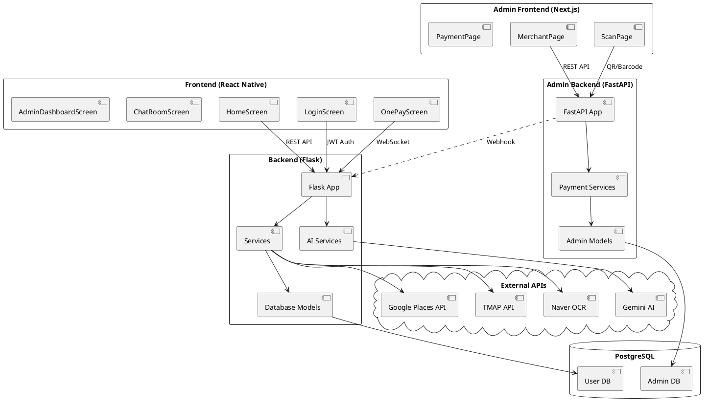
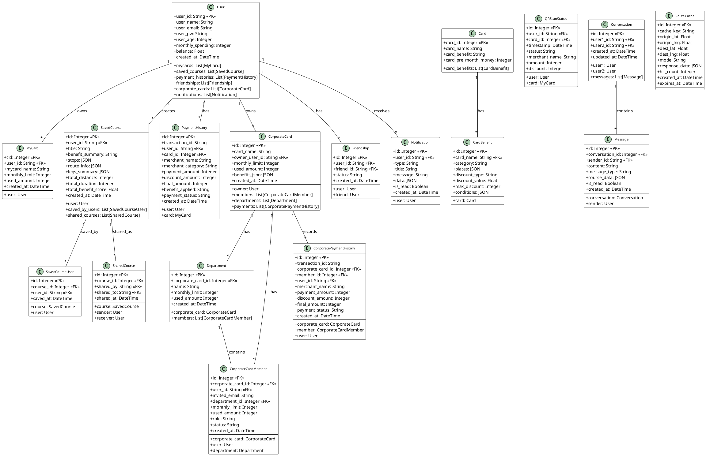
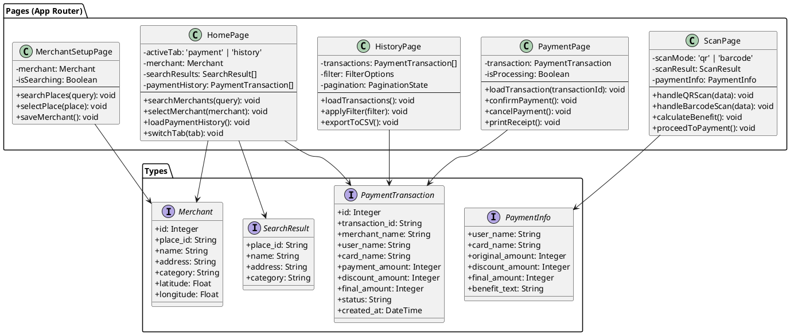
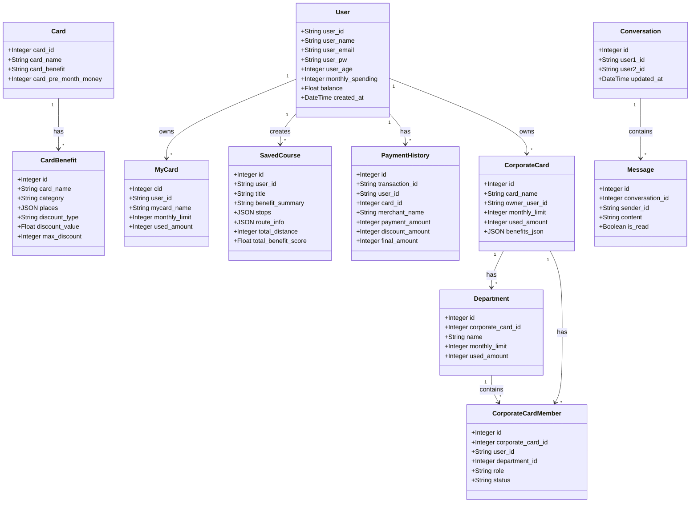
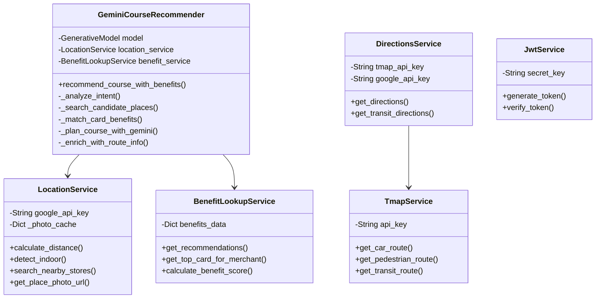

# Cardealo 클래스 다이어그램

## 1. 시스템 개요

Cardealo는 위치 기반 개인화 카드 혜택 추천 플랫폼으로, 4개의 주요 컴포넌트로 구성됩니다:

- **Backend (Flask)**: 메인 비즈니스 로직, 사용자 API
- **Admin-Backend (FastAPI)**: 가맹점 결제 처리
- **Frontend (React Native)**: 모바일 앱
- **Admin-Frontend (Next.js)**: 가맹점 관리 웹

---

## 2. PlantUML 클래스 다이어그램

### 2.1 전체 시스템 아키텍처



### 2.2 Backend 데이터베이스 모델



### 2.3 Backend 서비스 클래스

```plantuml
@startuml Cardealo_Backend_Services

skinparam classAttributeIconSize 0
skinparam classFontSize 10

package "Core Services" {
    class JwtService {
        -secret_key: String
        --
        +generate_token(user_id: String): String
        +verify_token(token: String): Dict
        +decode_token(token: String): Dict
    }

    class LocationService {
        -google_api_key: String
        -ncp_client_id: String
        -ncp_client_secret: String
        -_photo_cache: Dict
        --
        +calculate_distance(lat1, lng1, lat2, lng2): Float
        +detect_indoor(lat, lng, gps_accuracy, staying_duration): Dict
        +search_nearby_stores(lat, lng, radius, category): Dict
        +search_building_stores(building_name, user_lat, user_lng): List
        +get_place_details(place_id): Dict
        +get_place_photo_url(place_id): String
        -_search_single_type(lat, lng, radius, types): Dict
        -_search_all_categories_parallel(lat, lng, radius): Dict
        -_google_types_to_category(types): String
    }

    class DirectionsService {
        -tmap_api_key: String
        -google_api_key: String
        --
        +get_directions(origin, destination, waypoints, mode): Dict
        +get_transit_directions(origin, destination): Dict
        +calculate_transit_fare(route): Integer
        -_get_tmap_directions(origin, dest, waypoints): Dict
        -_get_google_directions(origin, dest, waypoints, mode): Dict
    }

    class GeocodingService {
        -ncp_client_id: String
        -ncp_client_secret: String
        --
        +get_coordinates(address: String): Dict
        +batch_geocode(addresses: List): List
        +reverse_geocode(lat, lng): String
    }

    class BenefitLookupService {
        -benefits_data: Dict
        --
        +load_benefits_data(): void
        +get_recommendations(merchant, category, cards): List
        +get_top_card_for_merchant(merchant, category, cards): Dict
        +calculate_benefit_score(benefit, amount): Float
        -_match_merchant(merchant, benefit_places): Boolean
        -_calculate_discount(benefit, amount): Integer
    }

    class TmapService {
        -api_key: String
        --
        +get_car_route(origin, destination, waypoints): Dict
        +get_pedestrian_route(origin, destination): Dict
        +get_transit_route(origin, destination): Dict
        +estimate_taxi_fare(origin, destination): Integer
        -_encode_polyline(coordinates): String
    }

    class NaverOCRService {
        -secret_key: String
        -invoke_url: String
        --
        +extract_text_from_image(image_path): Dict
        +parse_receipt_data(ocr_result): Dict
        -_preprocess_image(image): Bytes
    }

    class RouteCacheService {
        --
        +get_cached_route(cache_key): Dict
        +cache_route(cache_key, data, ttl): void
        +generate_cache_key(origin, dest, mode): String
        +get_cache_stats(): Dict
        +cleanup_expired(): Integer
    }
}

package "AI Services" {
    class LLMService {
        -model: GenerativeModel
        --
        +analyze_course_intent(user_input, location, cards): Dict
        +generate_course_summary(places, benefits): String
        -_build_intent_prompt(input, location): String
    }

    class CourseRecommender {
        -llm_service: LLMService
        -location_service: LocationService
        -benefit_calculator: BenefitCalculator
        -route_optimizer: RouteOptimizer
        --
        +recommend_courses(user_input, location, cards, max_distance): Dict
        -_search_candidate_places(intent, location, radius): List
        -_generate_course_candidates(places, num_stops): List
        -_score_course(course, cards): Float
    }

    class GeminiCourseRecommender {
        -model: GenerativeModel
        -location_service: LocationService
        -benefit_service: BenefitLookupService
        --
        +recommend_course_with_benefits(input, location, cards, budget): Dict
        -_analyze_intent(user_input, location): Dict
        -_search_candidate_places(intent, location, max_distance): List
        -_match_card_benefits(places, cards): List
        -_plan_course_with_gemini(places, intent, location): Dict
        -_enrich_with_route_info(course, user_location): Dict
        -_geocode_location(query): Dict
        -_get_tmap_directions(start, goal, waypoints): Dict
        -_get_driving_directions(start, goal, waypoints): Dict
    }

    class BenefitCalculator {
        -backend_url: String
        --
        +get_benefits_for_places(places, user_cards): List
        +calculate_total_benefit(course, cards): Float
        -_get_top_benefit(place, cards): Dict
    }

    class RouteOptimizer {
        -tmap_api_key: String
        -naver_client_id: String
        -naver_client_secret: String
        --
        +optimize_route(places, user_location, mode): List
        +calculate_route_distances(places): Dict
        -_nearest_neighbor(places, start): List
        -_two_opt_improvement(route, distances): List
    }
}

' Service Dependencies
GeminiCourseRecommender --> LocationService : uses
GeminiCourseRecommender --> BenefitLookupService : uses
CourseRecommender --> LLMService : uses
CourseRecommender --> LocationService : uses
CourseRecommender --> BenefitCalculator : uses
CourseRecommender --> RouteOptimizer : uses
DirectionsService --> TmapService : delegates
DirectionsService --> RouteCacheService : caches

@enduml
```



### 2.4 Admin-Backend 모델 및 서비스

```plantuml
@startuml Cardealo_Admin_Backend

skinparam classAttributeIconSize 0

package "Admin Backend Models" {
    class Merchant {
        +id: Integer <<PK>>
        +place_id: String
        +name: String
        +category: String
        +address: String
        +latitude: Float
        +longitude: Float
        +created_at: DateTime
        --
        +transactions: List[PaymentTransaction]
    }

    class PaymentTransaction {
        +id: Integer <<PK>>
        +transaction_id: String
        +merchant_id: Integer <<FK>>
        +user_id: String
        +card_name: String
        +payment_amount: Integer
        +discount_amount: Integer
        +final_amount: Integer
        +benefit_text: String
        +payment_status: String
        +created_at: DateTime
        +completed_at: DateTime
        --
        +merchant: Merchant
    }

    class AdminCardBenefit {
        +id: Integer <<PK>>
        +card_name: String
        +category: String
        +places: JSON
        +discount_type: String
        +discount_value: Float
        +max_discount: Integer
        +pre_month_config: JSON
        +limit_config: JSON
    }
}

package "Pydantic Schemas" {
    class MerchantCreate {
        +place_id: String
        +name: String
        +category: String
        +address: String
        +latitude: Float
        +longitude: Float
    }

    class MerchantResponse {
        +id: Integer
        +place_id: String
        +name: String
        +category: String
        +address: String
        +latitude: Float
        +longitude: Float
    }

    class QRScanRequest {
        +qr_data: String
        +merchant_id: Integer
        +payment_amount: Integer
    }

    class BarcodeScanRequest {
        +barcode_data: String
        +merchant_id: Integer
        +payment_amount: Integer
    }

    class PaymentProcessRequest {
        +transaction_id: String
        +confirm: Boolean
    }

    class PaymentResponse {
        +transaction_id: String
        +status: String
        +user_name: String
        +card_name: String
        +original_amount: Integer
        +discount_amount: Integer
        +final_amount: Integer
        +benefit_text: String
    }

    class BenefitCalculationResult {
        +discount_amount: Integer
        +discount_type: String
        +benefit_text: String
        +card_name: String
    }
}

package "Admin Services" {
    class BenefitCalculatorService <<async>> {
        --
        +calculate_benefit(card_name, category, amount, db): BenefitCalculationResult
        -_find_matching_benefit(card_name, category, db): AdminCardBenefit
        -_apply_discount(benefit, amount): Integer
    }

    class QRValidatorService {
        --
        +parse_qr_data(qr_data): Dict
        +verify_qr_signature(qr_data, signature): Boolean
        +is_qr_expired(timestamp): Boolean
        +extract_user_info(qr_data): Dict
    }

    class WebhookService {
        -user_backend_url: String
        -admin_secret_key: String
        --
        +notify_user_backend(transaction_data): Boolean
        +notify_qr_scan_status(user_id, status_data): Boolean
        -_send_webhook(url, payload): Response
    }
}

package "API Routers" {
    class MerchantsRouter {
        --
        +search_merchants(query, lat, lng): List[MerchantResponse]
        +select_merchant(merchant: MerchantCreate): MerchantResponse
        +get_merchant(merchant_id): MerchantResponse
    }

    class QRRouter {
        --
        +scan_qr(request: QRScanRequest): PaymentResponse
        +scan_barcode(request: BarcodeScanRequest): PaymentResponse
    }

    class PaymentRouter {
        --
        +process_payment(request: PaymentProcessRequest): PaymentResponse
        +get_payment_history(merchant_id, limit): List[PaymentTransaction]
        +cancel_payment(transaction_id): PaymentResponse
    }

    class BenefitsRouter {
        --
        +sync_benefits(): Dict
        +get_card_benefits(card_name): List[AdminCardBenefit]
        +get_all_cards(): List[String]
    }
}

Merchant "1" -- "*" PaymentTransaction

MerchantsRouter --> Merchant
QRRouter --> QRValidatorService
QRRouter --> BenefitCalculatorService
QRRouter --> PaymentTransaction
PaymentRouter --> PaymentTransaction
PaymentRouter --> WebhookService
BenefitsRouter --> AdminCardBenefit

@enduml
```



### 2.5 Frontend 컴포넌트 구조

```plantuml
@startuml Cardealo_Frontend_Components

skinparam classAttributeIconSize 0
skinparam classFontSize 10

package "Main Screens" {
    class HomeScreen {
        -stores: StoreCard[]
        -selectedStore: StoreCard
        -cardRecommendations: CardRecommendation[]
        -courseResult: AICourseResult
        -courseRoute: CourseRouteInfo
        -userLocation: Location
        --
        +fetchNearbyStores(): void
        +fetchCardRecommendations(store): void
        +fetchAICourseRecommendation(input): void
        +handleStoreSelect(store): void
        +handleCourseSelect(course): void
        +saveCourse(course): void
        +shareCourse(course, friendId): void
    }

    class LoginScreen {
        -email: String
        -password: String
        -isLoading: Boolean
        --
        +handleLogin(): void
        +handleKakaoLogin(): void
        +handleNaverLogin(): void
        +handleGoogleLogin(): void
        +handleAppleLogin(): void
        +navigateToSignup(): void
    }

    class SignupScreen {
        -userData: UserData
        -selectedCards: String[]
        -step: Integer
        --
        +handleSignup(): void
        +selectCard(cardName): void
        +validateInput(): Boolean
        +navigateToLogin(): void
    }

    class OnePayScreen {
        -selectedCard: MyCard
        -qrData: String
        -scanStatus: ScanStatus
        --
        +generateQRCode(): void
        +refreshQRCode(): void
        +handlePaymentComplete(result): void
        +connectWebSocket(): void
    }

    class ChatRoomScreen {
        -messages: Message[]
        -conversation: Conversation
        -inputText: String
        --
        +loadMessages(): void
        +sendMessage(): void
        +sendCourseShare(course): void
        +connectWebSocket(): void
        +markAsRead(): void
    }

    class AdminDashboardScreen {
        -corporateCard: CorporateCard
        -members: CorporateCardMember[]
        -departments: Department[]
        -usageStats: UsageStats
        --
        +loadCorporateCard(): void
        +loadMembers(): void
        +loadDepartments(): void
        +inviteMember(email): void
        +updateMemberLimit(memberId, limit): void
    }
}

package "Supporting Screens" {
    class ProfileScreen {
        -user: User
        -paymentHistory: PaymentHistory[]
        --
        +loadUserProfile(): void
        +loadPaymentHistory(): void
        +updateProfile(data): void
        +logout(): void
    }

    class CardBenefitScreen {
        -card: Card
        -benefits: CardBenefit[]
        --
        +loadCardBenefits(): void
        +searchBenefitByCategory(category): void
    }

    class FriendsScreen {
        -friends: Friend[]
        -pendingRequests: FriendRequest[]
        --
        +loadFriends(): void
        +sendFriendRequest(userId): void
        +acceptRequest(requestId): void
        +rejectRequest(requestId): void
    }

    class NotificationScreen {
        -notifications: Notification[]
        --
        +loadNotifications(): void
        +markAsRead(notificationId): void
        +markAllAsRead(): void
        +handleNotificationPress(notification): void
    }

    class ReceiptScanScreen {
        -capturedImage: Image
        -ocrResult: OCRResult
        -parsedData: ReceiptData
        --
        +captureReceipt(): void
        +processOCR(): void
        +confirmPayment(): void
    }
}

package "Utilities" {
    class ApiService {
        -baseUrl: String
        -authToken: String
        --
        +get(endpoint, params): Promise
        +post(endpoint, data): Promise
        +put(endpoint, data): Promise
        +delete(endpoint): Promise
        +setAuthToken(token): void
    }

    class AuthService {
        --
        +login(email, password): Promise
        +signup(userData): Promise
        +logout(): void
        +getStoredToken(): String
        +refreshToken(): Promise
    }

    class WebSocketService {
        -socket: Socket
        -userId: String
        --
        +connect(userId): void
        +disconnect(): void
        +emit(event, data): void
        +on(event, callback): void
        +joinRoom(roomId): void
    }
}

package "Contexts" {
    class NotificationContext {
        -notifications: Notification[]
        -unreadCount: Integer
        --
        +addNotification(notification): void
        +markAsRead(id): void
        +clearAll(): void
    }
}

' Dependencies
HomeScreen --> ApiService
HomeScreen --> WebSocketService
LoginScreen --> AuthService
OnePayScreen --> WebSocketService
ChatRoomScreen --> WebSocketService
AdminDashboardScreen --> ApiService

HomeScreen ..> NotificationContext : uses
NotificationScreen ..> NotificationContext : uses

@enduml
```



### 2.6 Admin-Frontend 페이지 구조



---

## 3. Mermaid 클래스 다이어그램

### 3.1 핵심 도메인 모델 (Mermaid)



### 3.2 서비스 레이어 (Mermaid)



---

## 4. 데이터 흐름도

### 4.1 결제 프로세스

```
[사용자 앱]                    [가맹점 앱]                  [Admin Backend]              [User Backend]
     |                              |                              |                           |
     | 1. QR 코드 생성              |                              |                           |
     |----------------------------->|                              |                           |
     |                              |                              |                           |
     |                              | 2. QR 스캔                   |                           |
     |                              |----------------------------->|                           |
     |                              |                              |                           |
     |                              |                              | 3. QR 검증 & 혜택 계산    |
     |                              |                              |-------------------------->|
     |                              |                              |                           |
     |                              | 4. 결제 정보 표시            |                           |
     |                              |<-----------------------------|                           |
     |                              |                              |                           |
     |                              | 5. 결제 확인                 |                           |
     |                              |----------------------------->|                           |
     |                              |                              |                           |
     |                              |                              | 6. Webhook: 결제 완료     |
     | 7. 결제 완료 알림 (WebSocket)|                              |-------------------------->|
     |<------------------------------------------------------------------------------------|
```

### 4.2 코스 추천 프로세스

```
[사용자 앱]                                    [Backend]                              [External APIs]
     |                                              |                                       |
     | 1. "홍대 데이트 코스 추천"                    |                                       |
     |-------------------------------------------->|                                       |
     |                                              |                                       |
     |                                              | 2. 의도 분석 (Gemini)                 |
     |                                              |-------------------------------------->|
     |                                              |<--------------------------------------|
     |                                              |                                       |
     |                                              | 3. 장소 검색 (Google Places)          |
     |                                              |-------------------------------------->|
     |                                              |<--------------------------------------|
     |                                              |                                       |
     |                                              | 4. 혜택 매칭 (내부 DB)                |
     |                                              |                                       |
     |                                              | 5. 코스 계획 (Gemini)                 |
     |                                              |-------------------------------------->|
     |                                              |<--------------------------------------|
     |                                              |                                       |
     |                                              | 6. 경로 정보 (TMAP)                   |
     |                                              |-------------------------------------->|
     |                                              |<--------------------------------------|
     |                                              |                                       |
     | 7. 코스 추천 결과                            |                                       |
     |<--------------------------------------------|                                       |
```

---

## 5. 클래스 통계

| 계층 | 타입 | 개수 |
|------|------|------|
| **Backend** | DB 모델 | 17 |
| | 서비스 클래스 | 8 |
| | AI 클래스 | 5 |
| **Admin-Backend** | DB 모델 | 3 |
| | Pydantic 스키마 | 8 |
| | 서비스 | 3 |
| | API 라우터 | 4 |
| **Frontend** | 화면 컴포넌트 | 20 |
| | Context | 1 |
| | 유틸리티 | 4 |
| **Admin-Frontend** | 페이지 | 5 |
| | 타입 인터페이스 | 4 |
| **총계** | | **82개** |

---

## 6. 주요 설계 패턴

1. **서비스 레이어 패턴**: 비즈니스 로직을 서비스 클래스로 분리
2. **리포지토리 패턴**: SQLAlchemy ORM을 통한 데이터 접근 추상화
3. **팩토리 패턴**: AI 서비스에서 코스 생성
4. **옵저버 패턴**: WebSocket 기반 실시간 알림
5. **캐싱 전략**: RouteCache, photo_cache를 통한 API 호출 최소화
6. **JWT 인증**: 토큰 기반 사용자 인증

---

## 7. 외부 의존성

| 서비스 | 용도 | 사용처 |
|--------|------|--------|
| Google Places API (New) | 장소 검색, 상세정보 | LocationService |
| Google Directions API | 경로 안내 | DirectionsService |
| Google Geocoding API | 주소 변환 | GeocodingService |
| TMAP API | 한국 경로 안내 | TmapService |
| Naver OCR API | 영수증 인식 | NaverOCRService |
| Google Gemini AI | 자연어 처리, 코스 추천 | LLMService, GeminiCourseRecommender |
