# Cardealo 시스템 아키텍처 (발표용)

> 버전: 2.1.0 | 작성일: 2025-12-12

---

## 1. 전체 시스템 아키텍처

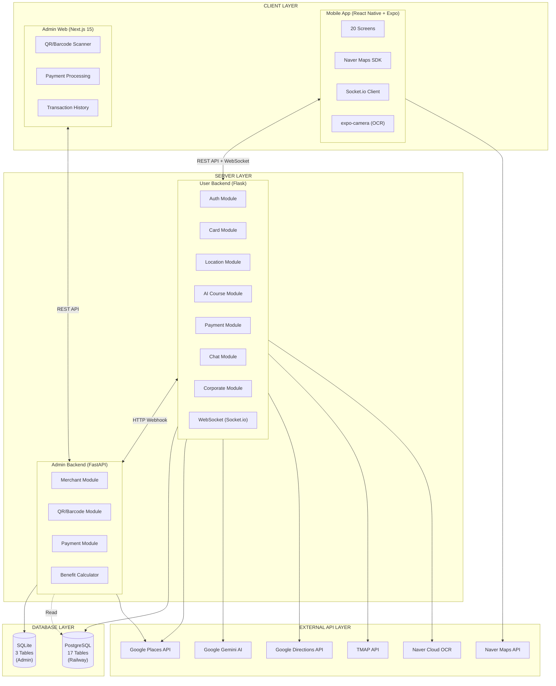

---

## 2. 상세 시스템 구성도

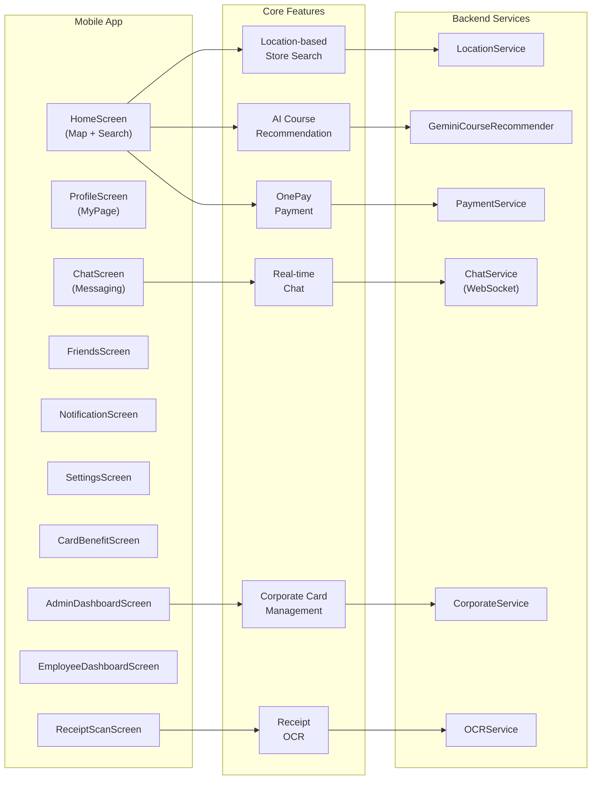

---

## 3. OnePay 결제 흐름

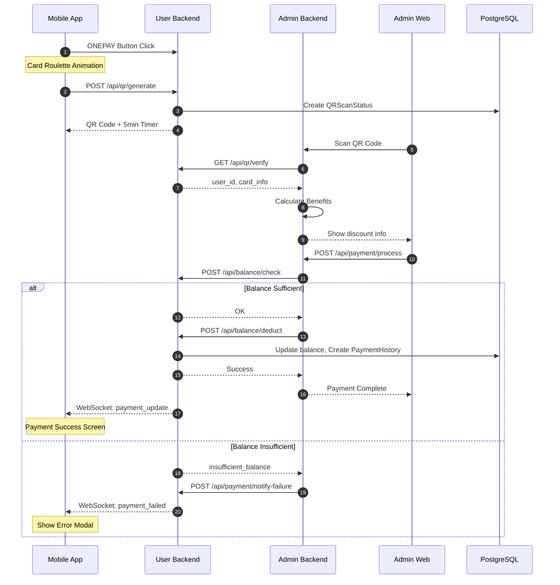

---

## 4. AI 코스 추천 흐름

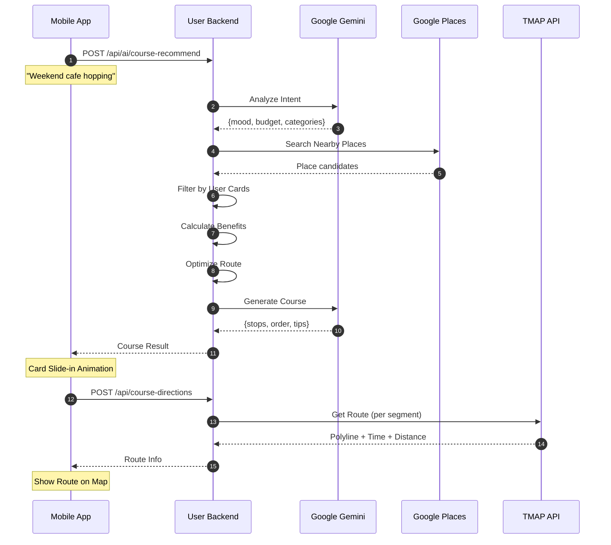

---

## 5. 실시간 채팅 및 정산 흐름

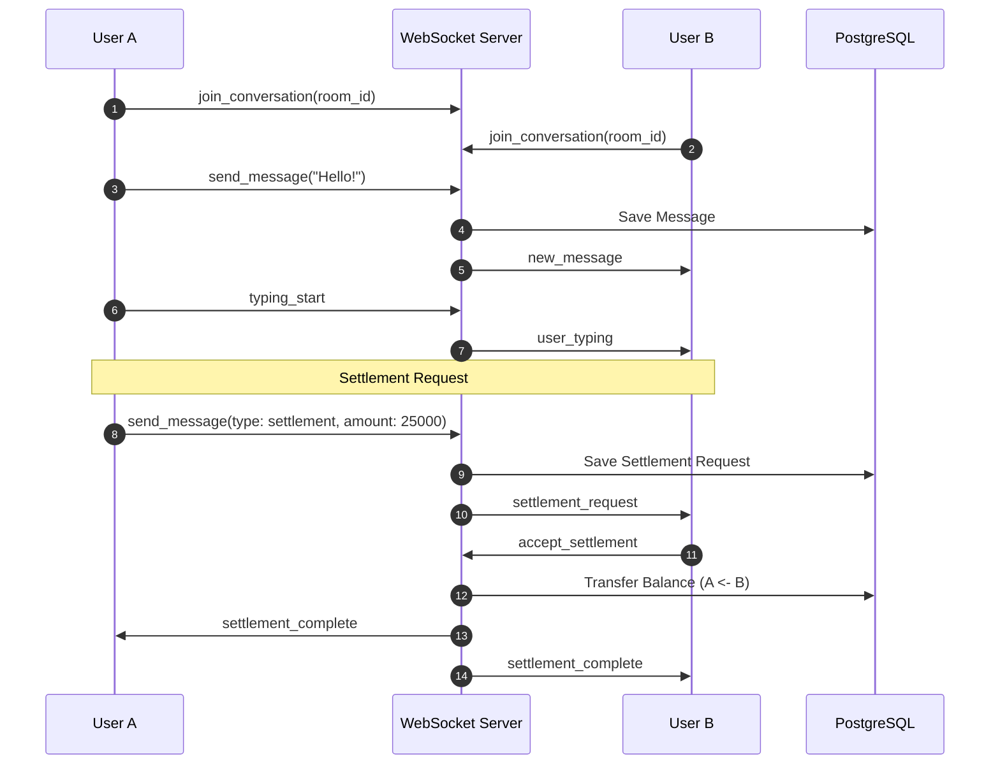

---

## 6. 법인카드 결제 및 한도 관리 흐름

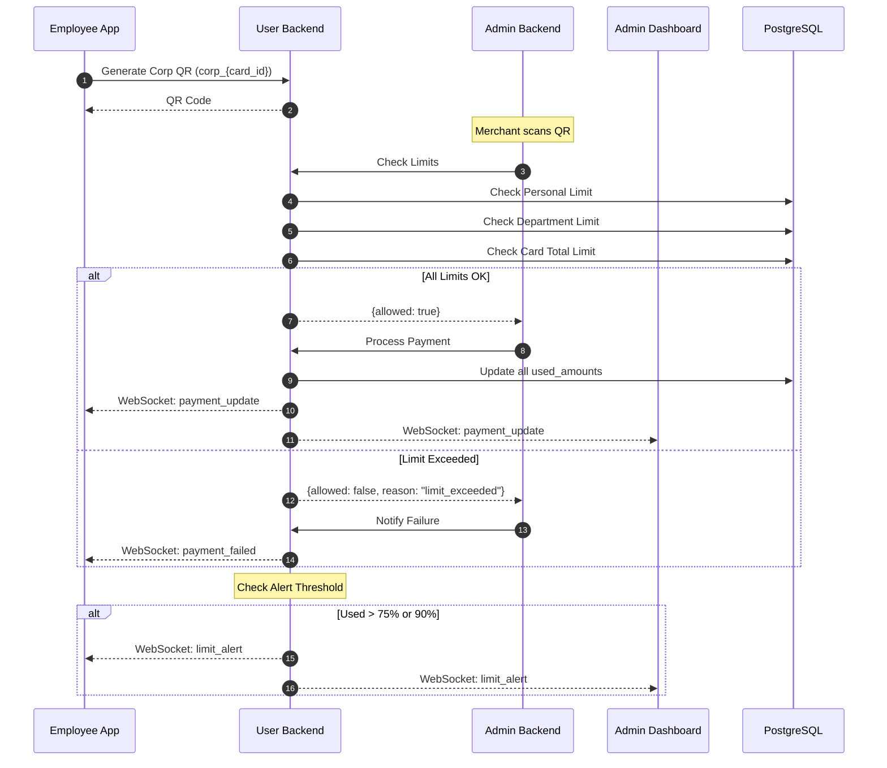

---

## 7. Mobile App 화면 구조

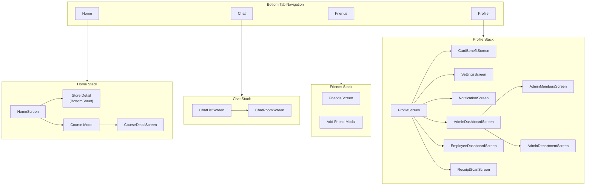

---

## 8. HomeScreen 기능 구조

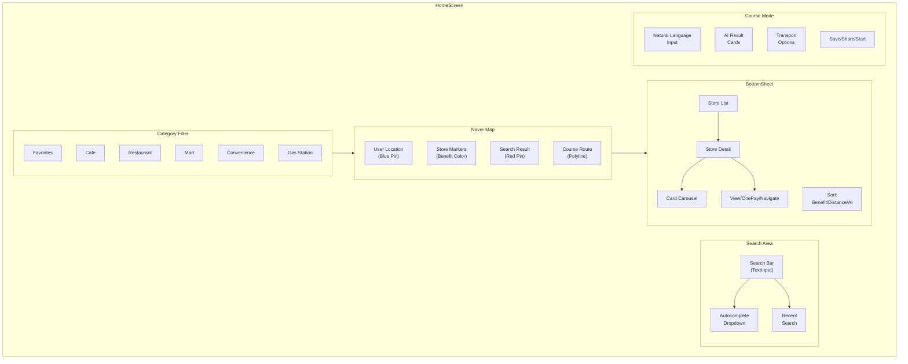

---

## 9. 데이터베이스 ER 다이어그램

```mermaid
erDiagram
    User ||--o{ MyCard : has
    User ||--o{ Friendship : has
    User ||--o{ Notification : receives
    User ||--o{ PaymentHistory : makes
    User ||--o{ SavedCourse : creates
    User ||--o{ CorporateCardMember : "is member of"

    User {
        int user_id PK
        string user_name
        string user_email UK
        string user_pw
        int balance
        datetime created_at
    }

    MyCard {
        int cid PK
        int user_id FK
        string mycard_name
        int monthly_limit
        int used_amount
    }

    Card {
        int card_id PK
        string card_name
        string card_benefit
        int card_pre_month_money
        string card_img_url
    }

    CardBenefit {
        int id PK
        string card_name
        string category
        string places
        string discount_type
        float discount_value
        int monthly_limit
    }

    Friendship {
        int id PK
        int user_id FK
        int friend_id FK
        string status
        datetime created_at
    }

    Conversation ||--o{ Message : contains
    Conversation {
        int id PK
        int user1_id FK
        int user2_id FK
        datetime created_at
    }

    Message {
        int id PK
        int conversation_id FK
        int sender_id FK
        string content
        string msg_type
        boolean is_read
        datetime created_at
    }

    Notification {
        int id PK
        int user_id FK
        string type
        string title
        string message
        json data
        boolean is_read
        datetime created_at
    }

    SavedCourse ||--o{ SavedCourseUser : "shared with"
    SavedCourse ||--o{ SharedCourse : "shared as"
    SavedCourse {
        int id PK
        int user_id FK
        string title
        json stops
        json route_info
        float total_distance
        int total_duration
        datetime created_at
    }

    SavedCourseUser {
        int course_id FK
        int user_id FK
        datetime saved_at
    }

    SharedCourse {
        int id PK
        int course_id FK
        int shared_by FK
        int shared_to FK
        datetime shared_at
    }

    PaymentHistory {
        string transaction_id PK
        int user_id FK
        int card_id FK
        string merchant_name
        string category
        int amount
        int discount_amount
        int final_amount
        datetime created_at
    }

    QRScanStatus {
        string transaction_id PK
        int user_id FK
        string status
        string merchant_name
        string category
        string card_name
        datetime created_at
        datetime expires_at
    }

    CorporateCard ||--o{ CorporateCardMember : has
    CorporateCard ||--o{ Department : has
    CorporateCard ||--o{ CorporatePaymentHistory : records
    CorporateCard {
        int id PK
        string card_name
        int owner_user_id FK
        int monthly_limit
        int used_amount
        datetime created_at
    }

    CorporateCardMember {
        int id PK
        int corporate_card_id FK
        int user_id FK
        int department_id FK
        string role
        int monthly_limit
        int used_amount
        string status
        datetime created_at
    }

    Department {
        int id PK
        int corporate_card_id FK
        string name
        int monthly_limit
        int used_amount
        string color
    }

    CorporatePaymentHistory {
        int id PK
        int corporate_card_id FK
        int member_id FK
        string merchant_name
        int amount
        int discount_amount
        string receipt_image_url
        datetime created_at
    }
```

---

## 10. Backend API 구조

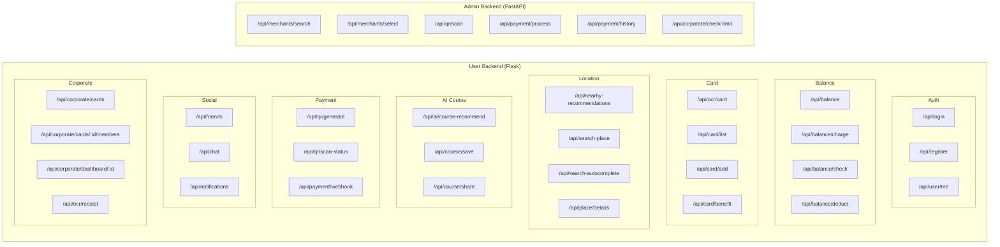

---

## 11. 기술 스택

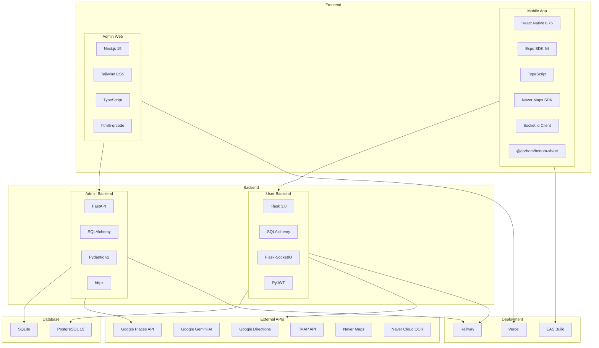

---

## 12. 배포 아키텍처

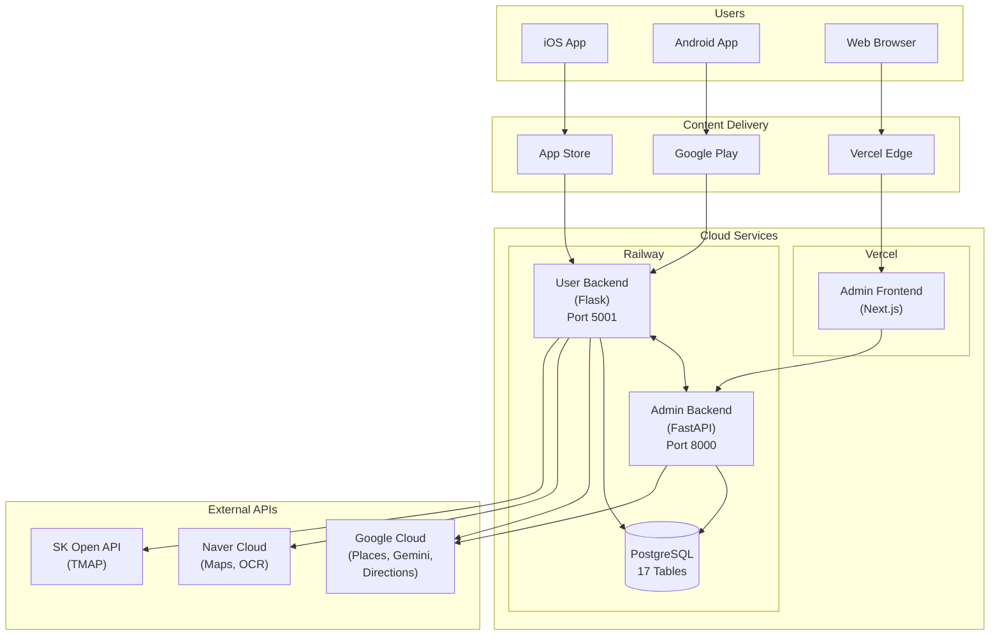

---

## 13. WebSocket 이벤트 구조

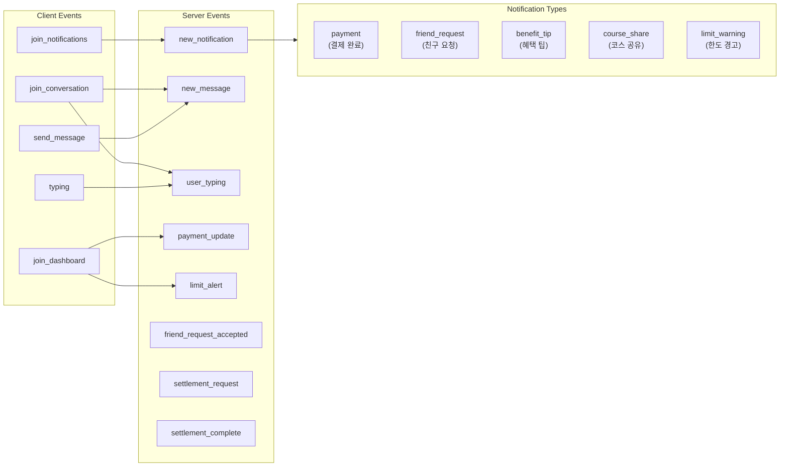

---

## 14. 혜택 계산 로직

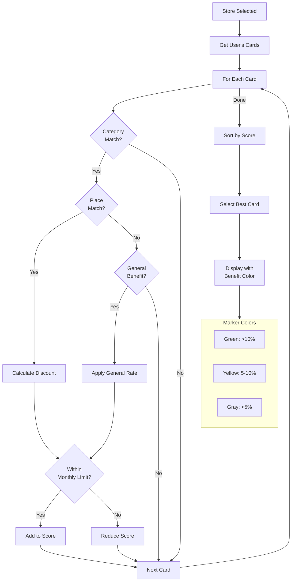

---

**문서 버전**: 2.1.0
**최종 업데이트**: 2025-12-12
